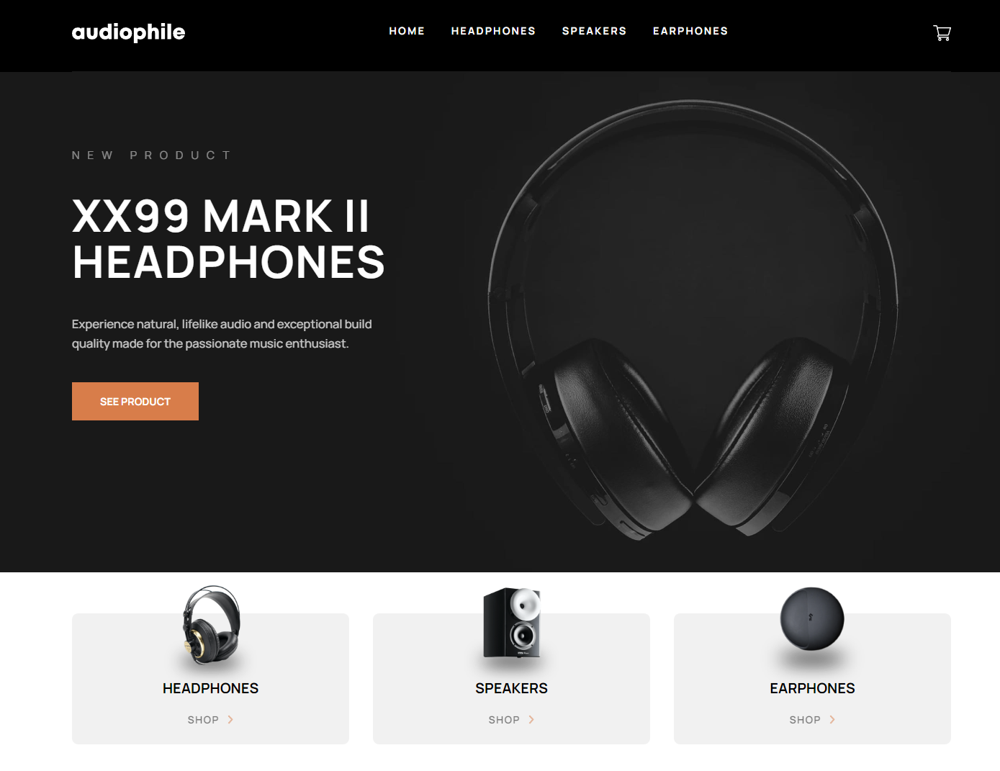

# Audiophile Ecommerce Website

## Tech Stack

- Semantic HTML5 markup
- CSS
- Javascript
- React
- Tailwind CSS

# Formatting

This projects uses code standars by appling the dependecies eslint and prettier tools:

- eslint: identifies bugs and patterns to make the code more consistent
- prettier: code formatter

## Live Demo

Explore the live demo of the Audiophile E-commerce website [here](https://ralfislask.github.io/Audiophile-Ecommerce/).

## Status

This project is marked as "Finished."

## Getting Started

To run the Audiophile E-commerce website on your local machine, follow these steps:

1. Download or clone the repository.
2. Install the necessary dependencies by running `npm install`.
3. Start the application using `npm start` (Create React App).

## App Description

The Audiophile E-commerce website lets the user pick between a number of headphones.

1. **Cart**: Choose between Numbers or Icons to match.

2. **Checkout**: Play solo or invite friends for a multiplayer experience (up to 4 players).

## Author

- Frontend Mentor - [@RalfiSlask](https://www.frontendmentor.io/profile/RalfiSlask)
- GitHub - [RalfiSlask](https://github.com/RalfiSlask)
